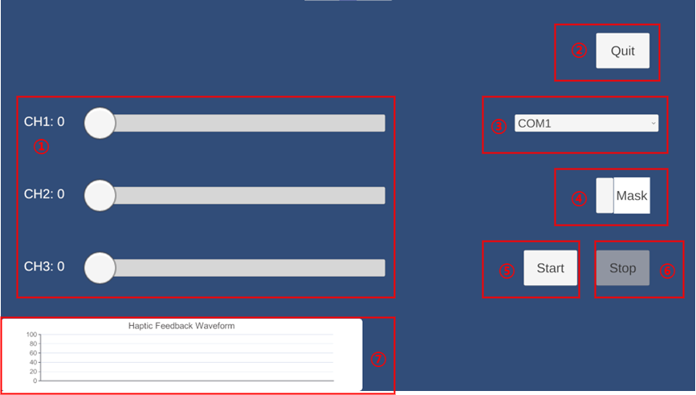

# Multi Voice Coil Debug Tool

## Description
This tool is used to debug the multi voice coil vibrotactile device designed by Dalian University of Technology. You can adjust the intensities of each voice coil, apply the masking effect, and view the vibration waveform in real time.

## Unity version
6000.0.23f1

## Interface

1. Intensity sliders for 3 channels. CH1: proximal, CH2: middle, CH3: distal
2. Click to quit the tool.
3. COM port dropdown. Please select the port of the RF hub.
4. Toggle for the use of masking model.
5. Click to start vibration.
6. Click to stop vibration.
7. The waveform of 3 channels.

## Notice
Please keep the RF hub connected to the computer during the whole process. 